# LOR-3000™

## 🧭 Summary

**LLM Orchestrator 3000™** is a backend-for-frontend service that unifies access to multiple LLM providers through a compiler-inspired architecture. It is built for frontend teams and external systems to interact with GPT-4, Claude, and future LLMs using a single, simple, and flexible HTTP API — without worrying about rate limits, prompt structuring, cost control, or failover logic.

This system allows:

* Provider abstraction (OpenAI, Claude, etc.)
* Smart fallback logic
* Versioned, composable prompt handling (Prompt Oven™)
* Session/thread/message storage (ThreadCore™)
* Feedback collection (EchoChamber™)
* Persistent memory context for chats (MemoryLane™)
* Observability & telemetry (Sentinel™)
* Flexible response formatting (OutputSmith™)

It’s modular, scalable, and designed to evolve into a full LLM runtime engine with RAG, tool use (FuncForge™), streaming, and dynamic pipelines.

### 🔧 Primary Use Cases

* Frontend apps that call LLMs and need consistency, structure, and memory
* Teams building AI assistants or tools across vendors
* Multi-turn chat history and versioned prompt control
* Rate-limiting and cost-controlled API access

### 🧱 Architecture Overview

```mermaid
graph TD
    A[Frontend App / UI] --> B[HTTP API: /chat]
    B --> C[Router Engine]
    C --> D[Prompt Oven™]
    C --> E[ThreadCore™]
    C --> F[OutputSmith™]
    C --> G[Sentinel™]
    D --> H[LLM Providers: GPT-4, Claude]
    E --> H
    F --> H
    G --> H
```



---

## 🎯 Overview

LLM Orchestrator 3000™ is a **backend-for-frontend** service that provides a unified, compiler-inspired abstraction layer over multiple LLM providers. It acts as a smart LLM gateway — handling routing, fallback, formatting, and token/cost management — so that frontend developers or external systems can interact with LLMs using a simple, consistent API.

---

## 📌 Goals (v1.0)

* Support **2 initial LLMs**: OpenAI GPT-4 and Claude 3 Opus
* Provide a unified HTTP API for frontend consumption
* Abstract provider SDKs, tokens, and fallback logic behind a clean interface
* Support fallback mechanism between models
* Output formatting: raw, markdown, json (via OutputSmith™)
* Minimal CLI (dev tool only, optional)
* Static JSON/YAML config
* Versioned prompt manager with Redis cache (Prompt Oven™)
* PostgreSQL-backed session/thread/message storage (ThreadCore™)
* Internal observer module for metrics/logging/monitoring (Sentinel™)
* Feedback collection layer for rating messages (EchoChamber™) *(post-v1.0)*
* Stateful thread context injection (MemoryLane™) *(post-v1.0)*

---

## 📦 Key Features

### ✅ REST API

* `POST /chat` → Handle prompt and return LLM response
* `GET /config` → Return supported models, settings (for frontend UI)
* `POST /pipeline` *(optional v1.1+)* → Run multi-step prompt chains

### ✅ Provider Abstraction (Frontend Layer)

* Normalize interaction with OpenAI and Claude APIs
* Shared `Provider` interface
* Hidden API key, token cost, and error handling logic

### ✅ Routing Engine (Middle-End)

* Chooses provider based on config
* Tries fallback on error/quota
* Logs usage & cost

### ✅ Compiler Passes (Middleware)

* TokenBudgetPass (ensure prompt fits model limits)
* Format enforcement (if needed)

### ✅ OutputSmith™ (Backend Formatter)

* Raw, JSON, Markdown formatting options
* Pluggable interface for future custom formatters
* Optional stream handling (v1.1+)

### ✅ Dev CLI (Optional)

* `lor3 run --prompt="..."` → Local dev use only

### ✅ Prompt Oven™ (Prompt Manager)

* Load system prompts from JSON/YAML config
* Store compiled prompts in Redis
* Support versioned prompts (e.g. `support_agent:v1`, `rag_summary:v3`)
* Optional syncing with OpenAI Assistants API
* CLI tooling:

  * `lor3 prompt list`
  * `lor3 prompt show <name>`
  * `lor3 prompt edit <name>`
  * `lor3 prompt sync <name>`
  * `lor3 prompt import --from-assistant-id=<id>`
* Prompt composition support (fragments/macros)

### ✅ ThreadCore™ (Database-backed Session/Message Tracking)

* PostgreSQL database
* Tables:

  * `sessions` → group by user
  * `threads` → conversation thread context
  * `messages` → full chat history
  * `prompt_versions` → system prompt snapshots
* Use cases:

  * Retrieve message context for multi-turn chats
  * Track model used, prompt version, token cost per message
  * Enable future analytics, prompt tuning, reverse learning

### ✅ Sentinel™ (Internal Observer/Logger)

* Tracks and logs all orchestration activity
* Logs:

  * Provider usage
  * Prompt version used
  * Token and cost stats
  * Failovers triggered
* Optional metrics:

  * Prompts per model
  * Error rates
  * Token spikes or cost anomalies
* Exports:

  * Local file logs
  * stdout
  * Prometheus endpoint (optional v1.1+)
* CLI tooling:

  * `lor3 observe usage`
  * `lor3 observe prompts`
  * `lor3 observe providers`
  * `lor3 observe errors`

### ✅ EchoChamber™ (Feedback Loop Engine — Post v1.0)

* Let frontend apps send feedback on assistant replies
* Adds `feedback` and `rating` fields to messages
* API to submit feedback on specific message ID
* Stored in PG alongside session/thread/message
* Enables:

  * Prompt improvement
  * Reverse learning
  * Analytics on assistant usefulness
* Planned CLI support:

  * `lor3 feedback rate <message_id> --rating thumbs_down --comment "Too vague"`
  * `lor3 feedback show <thread_id>`

### ✅ MemoryLane™ (Stateful Thread Context — Post v1.0)

* Allows multi-turn chat memory via thread context
* Pulls last `N` messages from thread and injects into request
* Configurable via `context_depth`
* CLI/HTTP param: `--context-depth=5`
* Use cases:

  * Multi-step chat UIs
  * Follow-up queries
  * Assistant continuity

---

## 🧱 Architecture (Inspired by GCC)

```
[Frontend Request] --> [Router] --> [Provider Adapter] --> [LLM API]
                             ↓
                 [Compiler Passes / Middleware]
                             ↓
  [Prompt Oven™] + [ThreadCore™] + [OutputSmith™] + [Sentinel™] + [EchoChamber™] + [MemoryLane™]
```

### Modules:

* `/frontend/` → Providers: `openai.go`, `claude.go`
* `/middleend/` → Router + passes: `router.go`, `tokenbudget.go`
* `/backend/` → OutputSmith™ formatter module
* `/runtime/` → Config, keys, usage state
* `/oven/` → Prompt manager, Redis cache, CLI assistant sync
* `/threadcore/` → PostgreSQL models, queries, session/message handling
* `/sentinel/` → Observer module for logging, metrics, telemetry
* `/echochamber/` → Feedback engine for user ratings *(v1.1+)*
* `/memorylane/` → Thread context memory injection *(v1.1+)*
* `/api/` → HTTP endpoints
* `/cli/` → Dev tool wrapper (optional)

---

## ⚙️ Tech Stack

* Language: **Go**
* HTTP Server: `net/http`, possibly `chi` or `fiber`
* Config: `viper`, env or JSON
* Logging: `zerolog`
* Redis for prompt cache
* PostgreSQL for session and message history (via `pgx` + migrations)
* RESTful API (OpenAPI spec planned)

---

## 🔁 Version Plan

| Version | Feature                                                                                |
| ------- | -------------------------------------------------------------------------------------- |
| v1.0    | GPT-4 + Claude, REST API, fallback, Prompt Oven™, ThreadCore™, OutputSmith™, Sentinel™ |
| v1.1    | EchoChamber™, MemoryLane™, optional streaming support                                  |
| v1.5    | Add Gemini support                                                                     |
| v1.6    | Add Mistral support                                                                    |
| v2.0    | Plugin system for dynamic provider loading                                             |
| v3.0    | Web UI (external project, frontend consumer)                                           |

---

## 🧾 Config Example (v1.0)

```json
{
  "primary": "openai:gpt-4",
  "fallbacks": ["claude:opus"],
  "passes": ["token-budget-check"],
  "format": "markdown",
  "max_tokens": 4000
}
```

---

## 📌 Non-Goals (v1.0)

* No user authentication (yet)
* No streaming support (planned for 1.1+)
* No UI / frontend in this project
* No plugin hot-reload

---

## 📅 Milestones

| Milestone     | Description                                 |
| ------------- | ------------------------------------------- |
| v1.0-init     | Project skeleton + config system            |
| v1.0-core     | Providers + router + fallback               |
| v1.0-api      | HTTP endpoints implemented                  |
| v1.0-oven     | Prompt Oven™ and Redis cache complete       |
| v1.0-thread   | PostgreSQL schema + ThreadCore™ integration |
| v1.0-sentinel | Observer module logs + CLI metrics complete |
| v1.0-done     | Testing, logging, docs done                 |

---

## ✅ Success Criteria

* `POST /chat` accepts prompt and returns generated response
* Response formats respected: raw, markdown, json
* If GPT-4 fails, fallback to Claude 3 Opus
* Frontend teams don’t need to touch LLM APIs directly
* Prompts can be versioned, cached, and composed
* Session/thread/message data is saved to PostgreSQL
* Sentinel logs provider usage, fallback, token/cost info
* EchoChamber™ collects feedback per message and stores in DB
* MemoryLane™ injects previous message context when enabled
* Easy to add new providers in v1.5+ without refactoring core
